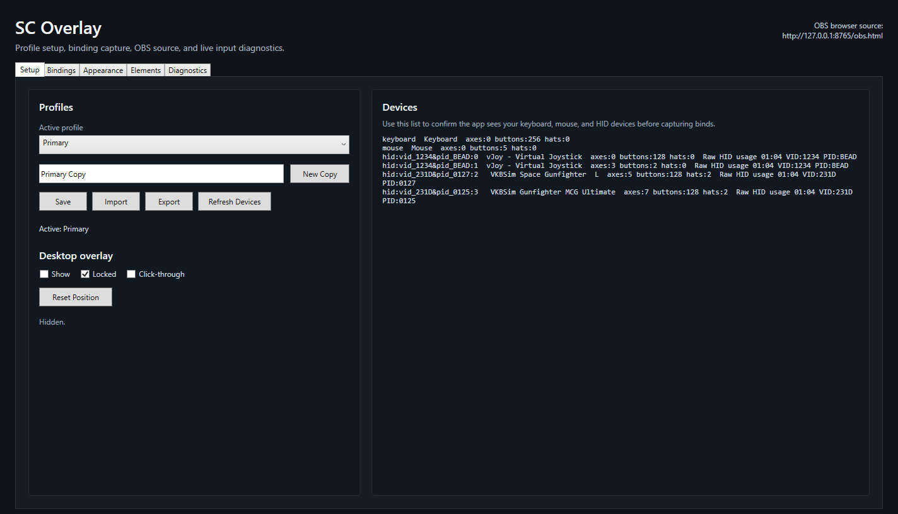
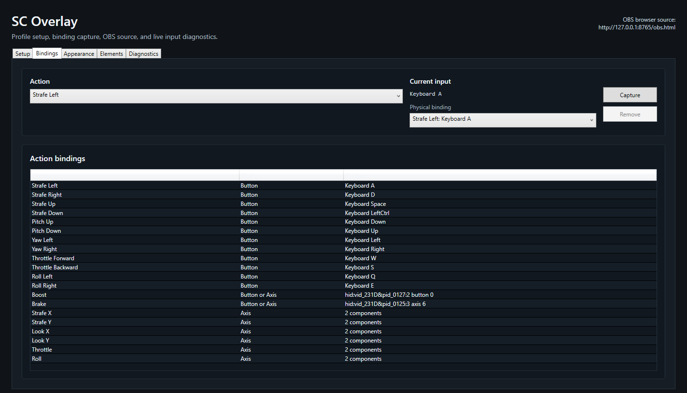
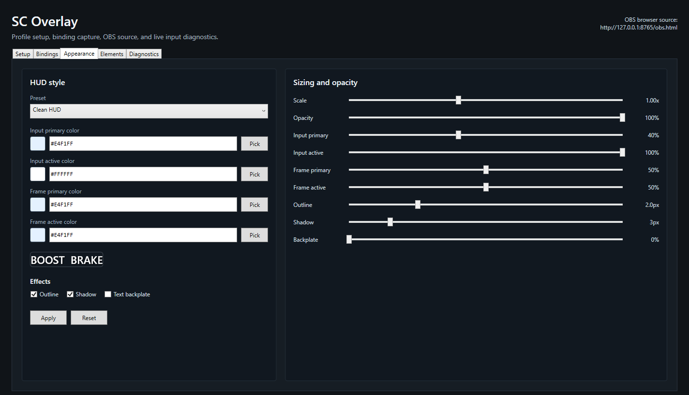
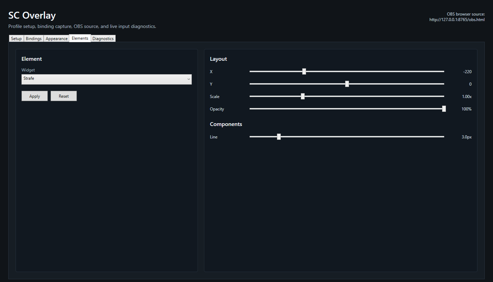
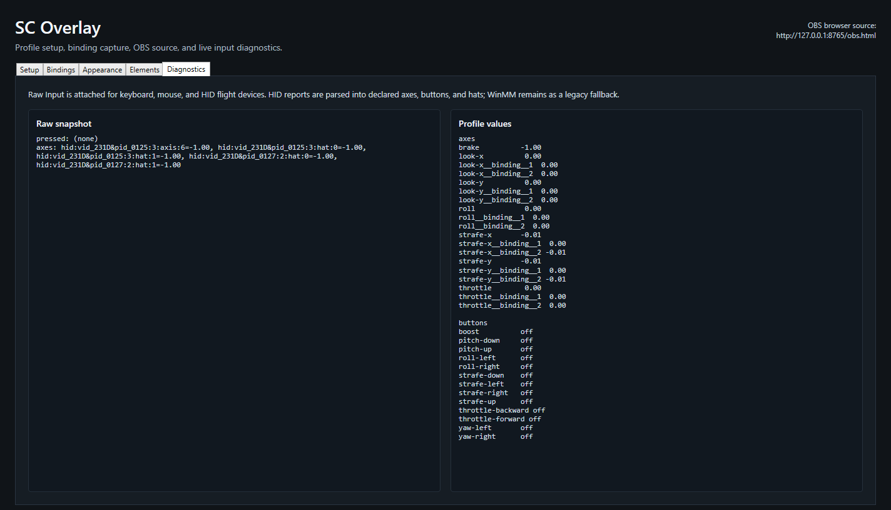

# SC Overlay

SC Overlay is a Windows overlay for showing Star Citizen flight inputs in OBS or directly on your desktop. It supports keyboard, mouse buttons, joystick, HOTAS, HOSAS, and mixed-device setups, so you can bind the controls you actually fly with instead of forcing everything into one device type.

The app is built for normal use: run the installer, launch it from the Start Menu, bind your controls, customize the HUD, copy the OBS URL if you stream, and fly. You should not need to edit Python files, hand-write JSON, install the .NET runtime, or do weird dev-machine nonsense just to make the overlay work.

## Blunt Disclaimer

This app was built by a dumb human who needed an LLM to help write it. That does not automatically make the app bad, but it does mean you should treat early releases like early releases: test carefully, expect bugs, keep backups of profiles you care about, and do not assume the code has been blessed by a serious software company with a QA department and matching polo shirts.

Use it at your own risk. If it breaks, misreads an input, looks weird in OBS, or eats a profile, that is on the project, not on Star Citizen, CIG, Microsoft, OBS, your joystick manufacturer, or the moon.

## What It Does

SC Overlay can:

- Show live flight input widgets in OBS through a local browser source.
- Show the same overlay on your desktop with a transparent always-on-top window.
- Capture keyboard keys, mouse buttons, joystick buttons, joystick axes, and Raw HID inputs.
- Mix device types in one profile, such as keyboard plus right stick, mouse buttons plus throttle, or full HOTAS/HOSAS setups.
- Let you create, save, import, and export profiles from the app.
- Let you customize colors, opacity, widget scale, widget position, line thickness, rounded corners, shadows, outlines, and text backing.
- Show roll as a rotating ship image or as a classic indicator.
- Use seeded roll images from the original SC Overlay reference project.
- Show boost and brake state text, including optional shake when fully engaged.
- Export local diagnostics when something is not behaving correctly.
- Keep local session logs for troubleshooting.

SC Overlay is unofficial and is not affiliated with, endorsed by, or supported by Cloud Imperium Games.

## Requirements

- Windows 10 or Windows 11.
- A normal x64 PC.
- Star Citizen if you want to use it in-game.
- OBS Studio if you want the browser source overlay.

The installer and portable release are self-contained. You should not need to install the .NET runtime.

## Download And Install

1. Download `SCOverlay-<version>-win-x64-setup.exe` from the [GitHub Releases page](https://github.com/G1LL1ES/SCOverlay/releases).
2. Run the installer.
3. Leave **Create a Start Menu shortcut** selected unless you specifically do not want one.
4. Optionally select the desktop shortcut.
5. Launch SC Overlay from the Start Menu or the final installer page.

SC Overlay is intentionally unsigned. Windows SmartScreen may warn you because this free/open-source project does not maintain a code-signing certificate. Choose **More info** and then **Run anyway** only if you trust the release you downloaded.

SC Overlay also requests administrator access each time it starts. This produces a separate Windows UAC prompt showing an unknown publisher. Elevation is required for reliable input capture when Star Citizen is also running as administrator.

### Portable Alternative

The self-contained portable zip remains available for users who do not want an installed application:

1. Download `SCOverlay-<version>-win-x64-self-contained.zip`.
2. Extract the entire zip to a normal folder.
3. Run `SCOverlay.exe` from the extracted folder.

Do not run the app directly from inside the zip. The portable executable requests the same administrator access as the installed version.

## Updating

SC Overlay checks the public GitHub release feed in the background at most once per day. When a newer stable release exists, the app shows a non-blocking banner with a link to its release page. You can disable automatic checks or run a manual check from **Setup**.

To update, close SC Overlay, download the newer installer, and run it. The installer recognizes the existing installation and replaces it in the same stable location, so Start Menu and desktop shortcuts do not need to be recreated or remapped.

Profiles and settings live outside the installation directory and remain in place through upgrades.

## First Launch

On first launch, SC Overlay creates default profiles and opens the main app window.

The main tabs are:

- **Setup**: profile selection, profile import/export, OBS URL, desktop overlay controls, logs, diagnostics export, and detected devices.
- **Bindings**: bind each action to keyboard keys, mouse buttons, joystick buttons, or joystick axes.
- **Appearance**: global colors, opacity, effects, and presets.
- **Elements**: per-widget position, scale, opacity, roll mode, rotation, throttle shape, and boost/brake shake behavior.
- **Diagnostics**: live device input and evaluated profile values.

## Setup Tab

Use **Setup** to choose the active profile, manage profiles, start the desktop overlay, and copy the OBS browser source URL.

The detected devices list shows what SC Overlay can currently see from Windows. If you plug in or unplug devices, use **Refresh Devices** before binding controls.

Useful buttons:

- **Save Profile** saves changes to the current profile.
- **New Profile** creates a profile copy you can customize.
- **Import Profile** loads a profile JSON file.
- **Export Profile** saves the current profile as a JSON file you can back up or share.
- **Open Logs Folder** opens the local log folder.
- **Export Diagnostics** creates a local diagnostic report you can inspect or share when troubleshooting.
- **Check for Updates** checks the latest stable GitHub release without downloading or installing anything.

The **Check automatically** option is enabled by default. Update checks are local requests to GitHub; no profiles, bindings, diagnostics, or telemetry are uploaded.

## Bindings Tab

Use **Bindings** to connect overlay actions to your real controls.

Common actions include:

- Strafe left/right/up/down.
- Pitch up/down.
- Yaw left/right.
- Throttle forward/backward.
- Roll left/right.
- Boost.
- Brake.
- Analog strafe/look/throttle/roll/brake axes.

To bind an action:

1. Select the action.
2. Choose the capture type when applicable.
3. Click **Capture**.
4. Press the key, mouse button, joystick button, or move the joystick axis you want to bind.
5. Save the profile.

To remove a binding:

1. Select the binding.
2. Click **Remove**.
3. Save the profile.

Keyboard inputs and controller inputs can live in the same profile. You do not need separate profiles just because one action comes from a keyboard and another comes from a joystick.

When multiple devices affect the same final overlay action, SC Overlay evaluates the active bindings together and uses the current input state to drive the renderer. Keyboard-style button pairs become virtual axes, so digital controls can still drive analog-looking widgets.

Controller axis inversion is available for controller inputs. Keyboard inputs do not need axis inversion because their virtual axes are defined by positive and negative button bindings.

## Appearance Tab

Use **Appearance** to control the global look of the overlay.

Available controls include:

- Appearance presets.
- Input primary color.
- Input active color.
- Frame primary color.
- Frame active color.
- Overall opacity.
- Input primary opacity.
- Input active opacity.
- Frame primary opacity.
- Frame active opacity.
- Global widget scale.
- Outline toggle and width.
- Shadow toggle and blur.
- Text backplate toggle and opacity.

Color pickers are built in, so you do not need to look up hex codes.

Input colors affect the element showing the actual input reading. Frame colors affect the surrounding widget frame, dividers, and related non-input structure. This split lets you make subtle frames with bright active input, bright frames with subtle input, or anything in between.

## Elements Tab

Use **Elements** to customize individual widgets.

For each widget you can adjust:

- X position.
- Y position.
- Scale.
- Opacity.
- Line thickness or component thickness where supported.
- Corner radius where supported.

Widget-specific controls include:

- **Roll**: choose image mode or indicator mode.
- **Roll**: choose the roll image asset.
- **Roll**: set max rotation.
- **Throttle**: rounded corners and center-anchored forward/reverse fill.
- **Boost/Brake**: optional shake when maxed.

Click **Apply** to write changes into the active profile. Click **Reset** to reset the selected widget's appearance settings.

## Diagnostics Tab

Use **Diagnostics** when something feels wrong.

Diagnostics show:

- Detected input devices.
- Device names and available counts where the app can discover them.
- Stable diagnostic identities for devices where available.
- Raw keyboard, mouse, joystick, and HID input snapshots.
- Evaluated profile values, such as final strafe, look, throttle, roll, boost, and brake values.

Use diagnostics to answer three important questions:

- Does Windows expose the device to SC Overlay?
- Does the raw input value change when I press or move the control?
- Does the active profile convert that raw input into the overlay value I expected?

Diagnostics stay on your machine unless you choose to share the exported file.

## OBS Browser Source

SC Overlay serves a local browser source while the app is running.

1. Start SC Overlay.
2. Go to **Setup**.
3. Copy the OBS browser source URL shown in the app.
4. In OBS, add a **Browser** source.
5. Paste the URL.
6. Set the browser source size to match your desired canvas area.

The OBS source updates live as SC Overlay samples inputs. The server is local by default and is intended for the same machine running OBS.

If the default OBS port is already in use, SC Overlay attempts to fall back to another available local port and shows the temporary URL in the app.

## Desktop Overlay

The desktop overlay is a transparent always-on-top overlay window.

Controls are available from **Setup** and from the system tray icon:

- **Show** opens or hides the desktop overlay.
- **Locked** prevents moving or resizing the overlay.
- **Click-through** lets mouse clicks pass through the overlay to the window underneath. Enabling click-through also locks the overlay.
- **Reset Position** restores the desktop overlay to its default placement.

To move or resize the overlay:

1. Turn on **Show**.
2. Turn off **Locked**.
3. Turn off **Click-through** if it is enabled.
4. Drag or resize the desktop overlay.
5. Lock it again when placed.

Resizing scales the rendered HUD to the overlay window. Use the per-element scale and position controls when you want to rearrange individual widgets instead of scaling the whole overlay.

## Running With Star Citizen Focused

SC Overlay requests administrator access automatically every time it launches. This allows it to observe inputs while an elevated Star Citizen process is focused.

If you decline the UAC prompt, SC Overlay will not start. If focused input still fails after approving elevation, confirm in Task Manager that both Star Citizen and SC Overlay are running under the same Windows user and include a diagnostics export with any bug report.

## Files And Data

SC Overlay stores your user data in your Windows AppData folder. The important pieces are:

- **Profiles**: saved profile JSON files.
- **Profile backups**: automatic backups of profile changes.
- **Settings**: app-level settings.
- **Settings backups**: automatic backups used for recovery.
- **Logs**: local session logs.
- **Diagnostics**: local diagnostics exports.

You normally do not need to touch these files directly. Use profile import/export from the app when you want to back up or share a profile.

## Logs And Diagnostics

If something crashes, fails to start, or behaves strangely:

1. Open SC Overlay.
2. Go to **Setup**.
3. Click **Open Logs Folder** to inspect the latest log.
4. Click **Export Diagnostics** to create a local diagnostic report.

The diagnostic export can include app settings summaries, active profile metadata, detected devices, raw input snapshots, evaluated overlay values, and recent log lines.

Nothing is uploaded automatically.

## Optional Checksum File

Some releases include a `.sha256` file next to the portable zip. This is an optional integrity check: it lets users confirm the zip they downloaded matches the zip that was published.

Most users can ignore it. It is not a password, license key, or secret.

## Troubleshooting

### Inputs Work Until Star Citizen Is Focused

Approve the UAC prompt when SC Overlay starts. See [Running With Star Citizen Focused](#running-with-star-citizen-focused).

### OBS Shows Nothing Or Stops Updating

- Confirm SC Overlay is still running.
- Copy the OBS URL from the current app window again.
- Open the URL in a normal browser to confirm it renders.
- If the app reported a port fallback, use the fallback URL shown in the app.

### My Joystick Is Listed But Values Look Wrong

- Open **Diagnostics**.
- Move one axis or press one button at a time.
- Check whether raw values change.
- Rebind the action using capture instead of assuming the device's axis order.

Some HID devices report axes/buttons in surprising ways. Better calibration and reconnect tools are planned.

### The Desktop Overlay Is In The Way

- Disable **Click-through**.
- Unlock the overlay.
- Move or resize it.
- Lock it again.
- Re-enable click-through.

### Windows Warns About The App

The app is intentionally unsigned. Windows SmartScreen may warn you because this is a free portable build without a maintained code-signing certificate.

### I Want To Fully Remove SC Overlay

For an installed copy, open Windows **Installed apps**, find **SC Overlay**, and choose **Uninstall**. You can also rerun the installer to repair or update the application.

Uninstall deliberately preserves profiles, settings, backups, diagnostics, and logs. Delete the SC Overlay folder from your Windows AppData folder only when you also want to erase that user data.

For a portable copy, close SC Overlay and delete its extracted application folder. Portable and installed copies use the same AppData location.

## Source Code And License

The repository contains the full project history and source files. Installer and portable release artifacts contain only the application files, required runtime dependencies, overlay assets, and license needed by end users.

SC Overlay is released under the MIT License. See [LICENSE](LICENSE) for the full license text.

## Credits

SC Overlay was created as a replacement for the original Python-based SC Overlay experiment by G1LL1ES.

Star Citizen is a trademark of Cloud Imperium Games. This project is unofficial and is not affiliated with or endorsed by Cloud Imperium Games.
